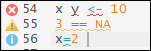
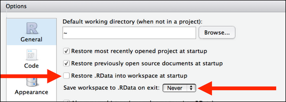

## Programa
1. Revisão dos exercícios
2. Trabalhando com scripts
3. Diretório de trabalho: organização e `here()`
4. Gerenciamento de projetos
5. Versionamento: Git e Github


# Scripts
## Trabalhando com scripts
Até agora, estávamos digitando os comandos diretamente no console. Isso não é errado e é até mais prático quando precisamos fazer algum cálculo rápido, mas é com o uso de <span class="red">scripts</span> que conseguimos tirar proveito do poder de uma linguagem de programação.

**Pense nos scripts como o registro da análise que você está fazendo**. Trabalhar com scripts permite que você faça análises mais complexas, com a documentação passo a passo do seu raciocínio. Outras pessoas podem usar seu script para reproduzir fidedignamente seus resultados, e você mesmo vai poder recuperar análises feitas no passado e saber exatamente o que fez.

Você pode abrir uma janela de script no menu, ou com o comando `Ctrl` + `Shift` + `N`

## Trabalhando com scripts
Scripts são arquivos de texto comuns, com a terminação .R

Crie um script com o nome `aula_3.R` e o salve em uma pasta no seu computador. Você pode guardar todas as atividades desta aula nesse arquivo, e a partir de agora pode também armazenar seus comentários, resultados de exercícios, etc.

Para enviar uma linha (ou conjunto de linhas) do script para o console do R, selecione a(s) linha(s) relevante(s) aperte `Ctrl` + `Enter`

A partir de agora, vamos sempre trabalhar com scripts!

## Trabalhando com scripts
Uma outra vantagem de trabalhar com scripts é que o RStudio nos dará alguns diagnósticos sobre o código.

<center>

</center>

Os avisos de estilo não são habilitados por padrão, mas, principalmente neste começo, recomendo fortemente que vocês o habilitem: 

`Tools -> Global Options -> Code -> Diagnostics ->`
`Provide R style diagnostics` 

## Trabalhando com scripts
Por fim, o RStudio tem uma série de atahos pra melhorar nossa qualidade de vida:

1. `Ctrl` + `Shift` + `A` para formatar seu código
```{r results='hide'}
# Cole a linha abaixo no seu script e utilize o poder de Ctrl + Shift + A
if(!exists("x")) { x=c(3, 5) }
```

2. `Ctrl` + `Shift` + `C` comenta automaticamente diversas linhas

3. `Ctrl` + `Alt` + `A` permite digitar várias linhas ao mesmo tempo

# Lar, doce lar
## Diretório de trabalho
O diretório de trabalho é o endereço da sua análise. Se o R precisar encontrar um arquivo ou criar um novo, ele vai usar esse endereço como referência. Para descobrir seu diretório de trabalho, utilie a função `getwd()`

```{r}
getwd()
```

Sempre que exportamos dados para algum arquivo, ele será salvo no diretório de trabalho por padrão

```{r}
bd <- rnorm(500, 0, 1)
write.csv2(bd, "arquivo_exportado.csv")
```

## Diretório de trabalho
Agora que conhecemos scripts e diretórios de trabalho, podemos pensar em um fluxo de armazenamento e de recuperação das análises. 

<span class="red">A ideia é que os scripts funcionem como a versão final da sua análise.</span> 

Podemos experimetar com funções no console e com objetos no workspace, mas a *versão final* do trabalho estará armazenada em forma de texto.

<center>

</center>

Todo nosso fluxo de trabalho está registrado no script. Usaremos os *workspaces* quando utilizarmos análises mais complexas.

## Caminhos relativos
À medida que seu trabalho se desenvolve, mesmo o diretório de trabalho pode ficar bagunçado. 

Eu costumo criar uma pasta dentro do meu diretório de trabalho para as bases de dados, por exemplo. Para salvar dentro dessa pasta, basta fazer uma pequena modificação no comando utilizado dois slides acima:
```{r results='hide'}
write.csv2(bd, "dados/arquivo_exportado.csv")
```

Se a pasta não existir, o R retornará uma mensagem de erro. Note que não precisamos (e nem queremos) usar o endereço absoluto do diretório (por exemplo, `V:/Treinamento R/Aula 3/dados`). 

<span class="red">Evitem utilizar diretórios absolutos.</span>

## Definindo seu endereço
Nem sempre (quase nunca) o R vai utilizar, por padrão, um diretório de trabalho adequado para o seu trabalho. Isso quer dizer que você vai precisar informar qual é o diretório correto, e faremos isso com a função `here()`
```{r message=FALSE, warning=FALSE, results='hide'}
# install.packages("here")
library(here)
here()
```

O `here()`determina automaticamente o diretório de trabalho adequado.

Alguns hereges ensinam a usar o comando `setwd()`, mas essa é uma prática **ruim e antiquada e errada e ruim**. 

Nós, que somos puros, só usamos o `here()`.


# Gerenciamento de projetos
## Gerenciamento de projetos
As atividades de análise de dados geralmente envolvem a manipulação de diversos tipos de arquivos: 

- bases de dados (originais e modificadas)
- scripts
- imagens
- relatórios com suas análises

Como geralmente estamos trabalhando com diversas análises ao mesmo tempo, a confusão pode ser grande.

<span class="red">Projetos</span> nada mais são do que uma pasta para organizar todos os arquivos referentes a uma análise, com algumas configurações adicionais. Seu uso não é obrigatório, mas é altamente recomendado. 

<center>
**Para cada análise, um projeto!**
</center>

## Gerenciamento de projetos
<center>

</center>

Lembre-se de que um projeto nada mais é do que uma pasta glorificada. 

Você pode transformar uma pasta já existente em um projeto, ou pode criar um projeto (uma pasta) do zero.

# Versionamento
## Por que usar o Git?
O Git é um sistema de versionamento para facilitar o acompanhamento e o compartilhamento de arquivos. Com ele, podemos:

- Acompanhar o progresso do código
- Ter um registro exato das modificações
- Recuperar versões anteriores
- Fazer contribuições nos códigos dos outros

Nós vamos passar rapidamente pela funcionalidade básica, mas saibam que existem muito mais ferramentas que não vamos ver por enquanto. 

Para um tratamento mais aprofundado da integração entre Git e RStudio, veja [Happy Git with R](https://happygitwithr.com)


## Github
O [Github](github.com) é uma interface para o uso do Git, juntando as vantagens do versionamento com ferramentas de armazenamento na nuvem e de colaboração online. Alguns outros serviços nessa linha são o [GitLab](gitlab.com) e o [Bitbucket](https://bitbucket.org/), mas o Github ainda é o mais utilizado.

Vamos precisar seguir os seguintes passos:

1. Criar uma conta no Github
2. Instalar o Git
3. Cadastrar credenciais no Git
3. Testar a conexão entre o Github e o RStudio

## Instalação do Git
Uma vez criada a conta no Github, precisamos instalar o Git no computador

1. [Baixar](https://gitforwindows.org/) o Git
2. Nas configurações, selecionar “Git from the command line and also from 3rd-party software”
3. Certificar-se de que o Git está instalado na pasta `C:/Program Files` (que é a opção padrão)

Se usar o Mac ou o Linux, consulte o [passo a passo](https://happygitwithr.com/install-git.html)

## Instalação do Git
Se tudo estiver instalado corretamente, você terá um programa chamado `Git Bash` no seu computador. Digite os seguintes comandos:

`git config --global user.name 'Seu nome'`
`git config --global user.email 'Seu e-mail de cadastro no Github'`
`git config --global --list`

Suas credenciais serão registradas, e seu login só sera pedido na primeira vez. Se o login for pedido toda vez que você usar o Git, será preciso fazer [algumas confgurações a mais](https://happygitwithr.com/credential-caching.html)

## Testando tudo
Nós configuramos muitas coisas separadas, e agora é a hora de ver se está tudo amarrado. Entre no Github e crie um novo repositório clicando no botão verde `New`

1. Dê um nome qualquer (nós apagaremos esse repositório depois)
2. Escreva uma descrição de teste
3. Deixe-o público
4. Não precisa alterar as demais configurações

Copie o link do seu repositório

## Testando tudo
Agora, voltamos para o RStudio

1. Crie um Novo Projeto com a opção *Version Control*
2. Cole o endereço do repositório no Github
3. Não mude o nome do diretório, deixe-o igual ao do repositório
4. A pasta será salva localmente. Escolha bem onde colocá-la

Você verá, na aba `Files`, o seu arquivo `README.md` do Github. *Voilà*!

## Testando tudo
Agora, basta fazer qualquer modificação nesse arquivo, fazer o *commit* e fazer o *push*

1. Pense nos *commits* como as versões do arquivo que você quer guardar. Mais ou menos como `tcc_versao_final_3.docx`
2. Para cada *commit*, você precisará escrever uma mensagem descrevendo o que mudou
2. Com o *push*, você está pegando todas as versões salvas e sincronizando com o Github. Enquanto você não fizer o *push*, os arquivos só existem no seu computador

Agora volte para o Github e veja se suas alterações foram salvas.

Esses são os comandos básicos do Git, e no futuro veremos mais opções. Por enquanto, o importante é saber fazer o básico e verificar se está tudo funcionando.


# Próximos passos
##
<center>
OBRIGADO PELA PACIÊNCIA!


A partir da próxima aula começamos com o que interessa


</center>


