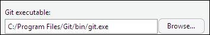
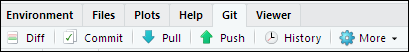

## Programa
1. Finalizar configuração do Github
2. Tipos de variáveis
3. Estatistica descritiva vs Estatística inferencial
4. Medidas de tendência central
5. Medidas de dispersão
6. Importação de bases de dados


# Continuando a última aula

## Revisão geral
Na semana passada vimos o que são:

- Scripts
- Diretórios de trabalho
- Projetos
- Git e Github (não terminamos)

Hoje vamos terminar a configuração básica do Github e dar os primeiros passos da análise estatística.

## Checagem geral
Só falta o último passo!

1. Criar uma conta no Github $\checkmark$
2. Instalar o Git $\checkmark$
3. Cadastrar credenciais no Git $\checkmark$
4. Testar a conexão entre o Github e o RStudio

Antes de prosseguir com o passo 4, vamos confirmar que os pontos 1 a 3 funcionaram normalmente. Abra o Git Bash e rode o comando `git config --global --list`

## Conexão entre RStudio e Github
Nossos computadores não têm usuários como administradores, por isso o execuável do Git não está instalado no local padrão. 

Se você instalar no seu computador pessoal, provavelmente nem precisará desse último passo, pois o RStudio vai conseguir localizar o Git **automaticamente**. Nos computadores da empresa, porém, temos que indicar manualmente onde está o Git.

`Tools` -> `Global Options` -> `Git/SVN`

<center>


**Reiniciar o RStudio**
</center>

## Testando tudo
Nós configuramos muitas coisas separadas, e agora é a hora de ver se está tudo amarrado. Entre no Github e crie um novo repositório clicando no botão verde `New`

1. Dê o nome "Aulas R"
2. Escreva uma descrição para o repositório
3. Deixe-o público
4. Não precisa alterar as demais configurações

Copie o link do seu repositório

## Testando tudo
Agora, voltamos para o RStudio

1. Crie um Novo Projeto com a opção *Version Control*
2. Cole o endereço do repositório no Github
3. Não mude o nome do diretório, deixe-o igual ao do repositório
4. A pasta será salva localmente. Escolha bem onde colocá-la

Você verá, na aba `Files`, o seu arquivo `README.md` do Github. *Voilà!*

## Testando tudo
<center>

</center>

1. Pense nos *commits* como as versões do arquivo que você quer guardar. Mais ou menos como `tcc_versao_final_3.docx`
2. Para cada *commit*, você precisará escrever uma mensagem descrevendo o que mudou
2. Com o *push*, você está pegando todas as versões salvas e sincronizando com o Github. Enquanto você não fizer o *push*, os arquivos só existem no seu computador

Agora volte para o Github e veja se suas alterações foram salvas.

Esses são os comandos básicos do Git, e no futuro veremos mais opções. Por enquanto, o importante é saber fazer o básico e verificar se está tudo funcionando.


# Introdução à Estatística

## Conceitos fundamentais
- Tipos de variáveis
- Estatistica descritiva vs Estatística inferencial
- Notação matemática básica
- Medidas de tendência central
- Medidas de dispersão

Para essa primeira exposição, vamos tratar dos conceitos fundamentais na lousa. Mas deixo registrados aqui os comandos principais do R para aplicação nos exercícios

```{r results='hide'}
popularidade_presidente <- c(3, 6, 5, 0, 2, 9, 5, 7, 10, 6)
mean(popularidade_presidente) # média
median(popularidade_presidente) # mediana
var(popularidade_presidente) # variância
sd(popularidade_presidente) # desvio-padrão
quantile(popularidade_presidente) # quantis

# Resumo Geral
summary(popularidade_presidente)
```

# Importação

## Importando bases de dados
O formato mais flexível de distribuição de bases de dados é o `csv`. Trata-se de um arquivo de texto sem estrutura proprietária, podendo, portanto, ser usado em qualquer pacote estatístico.

Duas fontes de dados importantes são o [CIS-USP](http://www.nadd.prp.usp.br/cis/index.aspx) e o [Cesop-Unicamp](https://www.cesop.unicamp.br/por). Ambos disponibilizam diversas bases de dados gratuitas, basta criar um cadastro. Ao longo do curso vamos conhecer outras bases de dados importantes.

Vamos usar um arquivo que baixei do site do CIS: a [avaliação da população sobre o Mensalão](http://www.nadd.prp.usp.br/cis/DetalheBancoDados.aspx?cod=B539&lng=pt-br). Vocês receberam o arquivo `csv` por e-mail. *Baixe-o no seu diretório de trabalho*.

## Importando bases de dados
Importaremos o arquivo com o pacote readr

```{r results='hide'}
# install.packages("readr")
library(readr)
```

Como todo arquivo `.csv`, nosso banco de dados é delimitado por caracteres especiais. Note que na função abaixo estamos especificando `;` como o delimitador

```{r message=FALSE, warning=FALSE, results='hide'}
bd <- read_delim("BD_CIS0539.csv", ";", escape_double = FALSE, trim_ws = TRUE)
View(bd)
```

## Importando bases de dados
Com pacotes especializados, também podemos importar bases de dados do Excel e de outros pacotes estatísticos, como o SPSS. Veremos como usar esses pacotes nas próximas aulas.

Vocês perceberam que os nomes de algumas variáveis nesse banco de dados indicam o número da pergunta, e não que pergunta foi feita. Você pode consultar o questionário (também enviado por e-mail) para verificar do que se trata a pergunta 2, por exemplo.

Por exemplo, para ver a distribuição de preferências partidárias, podemos usar o comando `table()`
```{r results='hide'}
table(bd$PARTIDO)

```


Nas próximas aulas veremos como limpar essa base de dados (tratamento de NAs, por exemplo), e como tratar de bases de dados mais bagunçadas.
